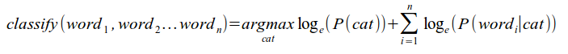

<h1>Naive Bayes Classifier</h1>

->CS 165A – Artificial Intelligence, Winter 2014 <-
 
->Machine Problem 2<-

->by<-

->Marc Juchli / mail@marcjuch.li<-

->(Marc 10, 2014)<-

   

<h2>General</h2>

### Programming Language

The application is based on Java. 

### Program Execution

Within the `src` folder:

	make
	./Runfile
	
Note: prediction.txt will be overriden each time the program is executed.

To run in by hand: `java Main smsSpamCollection-train.txt smsSpamCollection-test-sample.txt`

<h2>Design</h2>

### Main

The main is just for demonstration purposes. It's main method takes the first argument as:

- training file
- test file

And writes the result to the file `prediction.txt`

### Classifier

(This class definitely needs to be restructured. Since I have to turn in soon I leave it as it is for the moment.)

The classifier class will do in the end basically 2 things:
	
1. training
2. testing

#### loadTrainMessages()
	
Saves the training messages in an `ArrayList<MessageNode>` where MessageNode contains an `String cat` and an `ArrayList<String> text`. 

This means after processing every message and also it's containing words are separated in an array and ready to be used. 

#### train()

This generates a `HashMap<String, HashMap<String, Double>> categories` that could look as follows:

	ham
		word, 5
		anotherone, 3
		dog, 10
		
	spam
		penis, 10
		sex, 8
		
		
#### loadTestMessages()

Returns a `ArrayList<ArrayList<String>>` for a given test message. The message is splitted up in words.

#### calculateProbability()

This key method will calculate the probability for a given `ArrayList<String> message` (array of words) and a category.

For each word check it's occurence in the given category:

	Double occuranceInCategory = categories.get(category).get(word);
	
If it occurs (the value is not null) then we can add this occurance over the total words of the given category. 

	probMessageIsCat += Math.log10(occuranceInCategory/wordsPerCategory(category));

Otherwise we just add a default value:

	probMessageIsCat += Math.log10(0.000001);
	

After every word is processed, we have the probability of the message compared to the given category.

### Tokenizer

This class is used to exclude stop words and unneccessary characters (e.g. '.', ',', ':', ... ) from the given messages.

<h2>Algorithm details</h2>

In this project I followed the suggestions from here: https://www.bionicspirit.com/blog/2012/02/09/howto-build-naive-bayes-classifier.html

<h2>Difficulties</h2>

The process of developing the application and figure out how the algorithm works in detail worked pretty good.

<h2>Thoughts</h2>

### Architecture

The archtitecture of this program is still not perfect.
